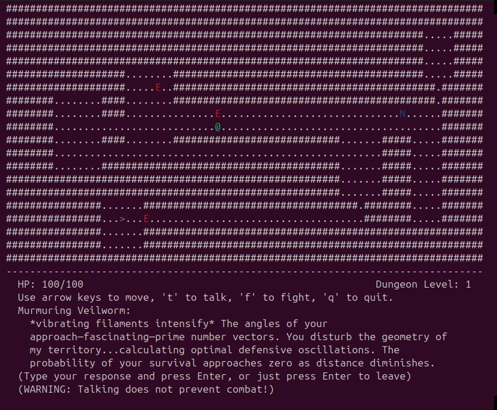

# Roguelike LLM Dungeon

A roguelike dungeon crawler game with NPCs and enemies generated using Claude 3.7 Sonnet via Portkey.



## Features

- Terminal-based roguelike gameplay with procedurally generated dungeons
- NPCs and enemies with unique personalities and behaviors generated by LLMs
- Dynamic conversations with NPCs using Claude 3.7 Sonnet
- Combat system with enemies that have varying behaviors
- Multiple dungeon levels with increasing difficulty
- Automatic character saving for seamless reuse in future playthroughs
- Dialogue history system to review past conversations

## Requirements

- Python 3.8+
- Portkey AI API key (for LLM access)
- Python packages (see requirements.txt)

## Installation

1. Clone the repository:
```
git clone https://github.com/yourusername/roguelike-llm-dungeon.git
cd roguelike-llm-dungeon
```

2. Install required packages:
```
pip install -r requirements.txt
```

3. Set up your Portkey API keys in a `.env` file:
```
PORTKEY_API_KEY=your_portkey_api_key
PORTKEY_VIRTUAL_KEY_ANTHROPIC=your_portkey_anthropic_virtual_key
```

## How to Play

Run the game with:
```
python main.py
```

### Command-line Options

The game supports the following command-line options:

```
python main.py                        # Generate and save new characters (default)
python main.py --no-save-characters   # Generate characters without saving them
python main.py --use-pregenerated     # Use pre-generated characters from previous runs
```

- By default, all generated NPCs and enemies will be saved to files in the `game/data/` directory.
- `--no-save-characters`: Disables automatic saving of generated characters.
- `--use-pregenerated`: Uses characters previously saved to files instead of generating new ones (faster startup and no API calls).

### Controls

- Arrow keys: Move the player character
- t: Talk to adjacent NPCs
- f: Attack adjacent enemies
- s: Save character data manually (even if automatic saving is enabled)
- h: View dialogue history (use UP/DOWN to scroll, ESC to exit)
- q: Quit the game

## Dialogue System

The game features a rich dialogue system for interacting with NPCs:
- Press 't' when adjacent to an NPC to talk to them
- Longer dialogues are automatically split into readable chunks
- Press 'h' to access the dialogue history which lets you review all past conversations
- Use UP/DOWN arrow keys to scroll through dialogue history and ESC to return to the game

## Project Structure

- `game/`: Main game package
  - `engine/`: Game engine components
  - `entities/`: Game entities (player, NPCs, enemies)
  - `world/`: Dungeon generation and management
  - `data/`: Stored character data
- `main.py`: Entry point
- `portkey.py`: LLM integration

## Character Generation and Storage

The game uses Claude 3.7 Sonnet to generate unique NPCs and enemies with personalities and dialogue. By default, these are automatically saved to JSON files in the `game/data/` directory:

- `npcs.json`: Saved NPC character data
- `enemies.json`: Saved enemy character data

Character data is saved automatically when new characters are generated and when exiting the game. You can also press 's' during gameplay to manually save the current character cache.

## Extending the Game

- Add new entity types in `game/entities/`
- Modify NPC and enemy generation prompts in `game/entities/npc_generator.py`
- Change dungeon generation parameters in `game/world/map_generator.py`

## License

MIT License

## Acknowledgements

- This project uses [Portkey](https://portkey.ai/) to access Claude 3.7 Sonnet from Anthropic
- Built using Python's curses library for terminal rendering 